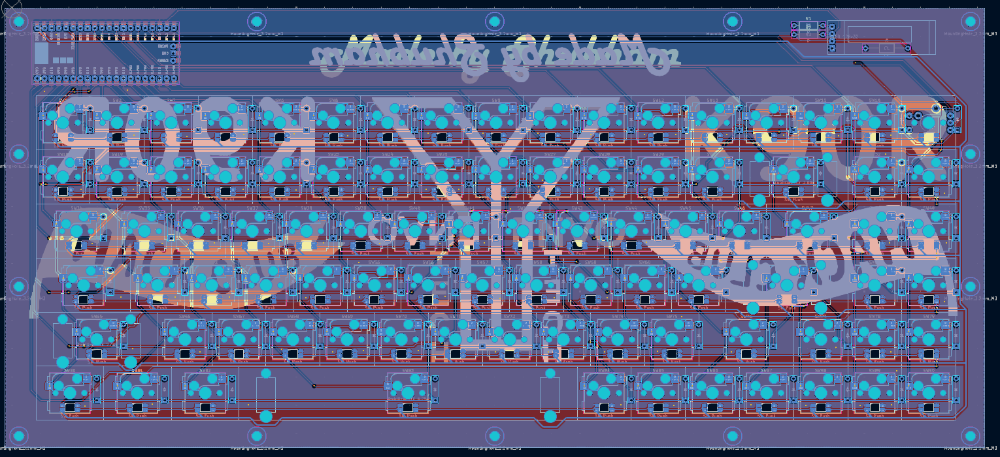

# K90R
A Custom 90 Keys Keyboard including Rotary Encoder Switch, OLED powered by Rasberry Pi Pico MCU and KMK Firmware.

## Features
- Per-Key RGB LED
- Hotswap Sockets
- OLED Display
- Rotary Encoder

## Bill of Materials

| Name                              | Quantity | Pack Of | Price (INR) | Cost (INR) | Cost (USD) | Source     |
|-----------------------------------|----------|---------|-------------|------------|------------|------------|
| Gateron G Pro 3.0 Yellow          | 90       | 10      | 200         | 1800       | 19.8       | [StacksKB](https://stackskb.com/store/gateron-g-pro-3-0-yellow-ks-9-linear-switch-pack-of-10/)                |
| Veekos Gradient Keycaps           | 1        | 1       | 1299        | 1299       | 14.289     | [StacksKB](https://stackskb.com/store/veekos-gradient-keycaps-cherry-profile-135-keys/)                       |
| Durock Smokey Screw-In Stabilizers| 1        | 1       | 1595        | 1595       | 17.545     | [StacksKB](https://stackskb.com/store/durock-smokey-screw-in-stabilizers-v2/)                                 |
| Gateron Hotswap Sockets           | 90       | 1       | 10          | 900        | 9.9        | [StacksKB](https://stackskb.com/store/gateron-hotswap-sockets/)                                               |
| 1N4148 Diode                      | 100      | 100     | 99          | 99         | 1.089      | [Amazon](https://amzn.in/d/aevNe5M)                                                                           |
| Raspberry Pi Pico                 | 1        | 1       | 348         | 348        | 3.828      | [Robocraze](https://robocraze.com/products/raspberry-pi-pico)                                                 |
| 0.91 Inch OLED Display            | 1        | 1       | 152         | 152        | 1.672      | [Robocraze](https://robocraze.com/products/0-91-inch-blue-oled-display-module)                                |
| Rotary Encoder Module             | 1        | 1       | 44          | 44         | 0.484      | [Robocraze](https://robocraze.com/products/rotary-encoder-module)                                             |
| SK6812MINI-E                      | 90       | 1       | 6           | 540        | 5.94       | [LCSC](https://lcsc.com/product-detail/RGB-LEDs-Built-in-IC_OPSCO-Optoelectronics-SK6812MINI-E_C5149201.html) |
| PCB (Option A)                    | 1        | 1       | 5429        | 5429       | 59.719     | [PCBPower](https://www.pcbpower.com/page/pcb-fabrication)                                                     |
| PCB (Option B)                    | 1        | 1       | 5325        | 5325       | 58.575     | [JLCPCB](https://jlcpcb.com/)                                                                                 |
| PCB (Option C)                    | 1        | 1       | TBD         | TBD        | TBD        | [LionCircuits](https://www.lioncircuits.com/)                                                                 |
| 4.7 kΩ Resistor                   | 2        | 1       | -           | -          | -          | Self                                                                                                          |
| 0.1 µF Capacitor                  | 1        | 1       | -           | -          | -          | Self                                                                                                          |
| Allen CSK M3 Screw 30mm           | 5        | 1       | 11          | 55         | 0.605      | [Novo3D](https://novo3d.in/allen-csk-screw/)                                                                  |
| Allen CSK M3 Screw 25mm           | 2        | 1       | 9           | 18         | 0.198      | [Novo3D](https://novo3d.in/allen-bolt-cs/)                                                                    |
| Allen Bolt M3 Screw 20mm          | 2        | 1       | 7           | 14         | 0.154      | [Novo3D](https://novo3d.in/allen-csk-screw/)                                                                  |
| Allen CSK M3 Screw 16mm           | 5        | 1       | 7           | 35         | 0.385      | [Novo3D](https://novo3d.in/allen-csk-screw/)                                                                  |
| Brass Heat Set M3 6mm             | 14       | 1       | 3           | 42         | 0.462      | [Novo3D](https://novo3d.in/brass-heat-set/)                                                                   |
| 3D Printed Bottom                 | 1        | 1       | -           | -          | -          | Printlegion                                                                                                   |
| 3D Printed Top                    | 1        | 1       | -           | -          | -          | Printlegion                                                                                                   |
| 3D Printed Plate                  | 1        | 1       | -           | -          | -          | Printlegion                                                                                                   |
| Shipping Charge Amazon            | 1        | 1       | 100         | 100        | 1.1        | [Amazon](https://amzn.in/)                                                                                    |
| Shipping + Handling LCSC          | 1        | 1       | 590         | 590        | 6.49       | [LCSC](https://lcsc.com/)                                                                                     |
| Misc.                             | 1        | 1       | 200         | 200        | 2.2        | Self                                                                                                          |
| **Total**                         |          |         |             | **13156**  | **144.716**|                                                                                                               |

## Keyboard

## SideView

## Circuit

### Schematic

### PCB

### 3D 

## Additional Information

- **Firmware**: [KMK](https://github.com/KMKfw/kmk_firmware/)
- **Symbols and FootPrints**: [ScottoKicad](https://github.com/joe-scotto/scottokeebs/tree/main/Extras/ScottoKicad)
- **PCB Software**: [Kicad](https://www.kicad.org/)
- **3D Design Software**: [Autodesk Fusion 360](https://www.autodesk.com/in/products/fusion-360/overview)
