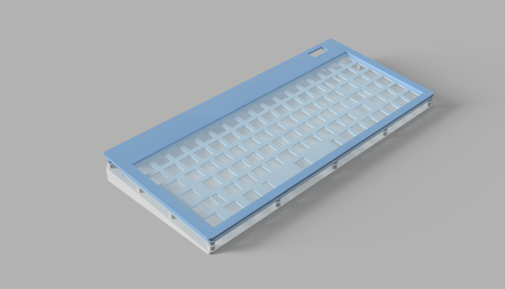
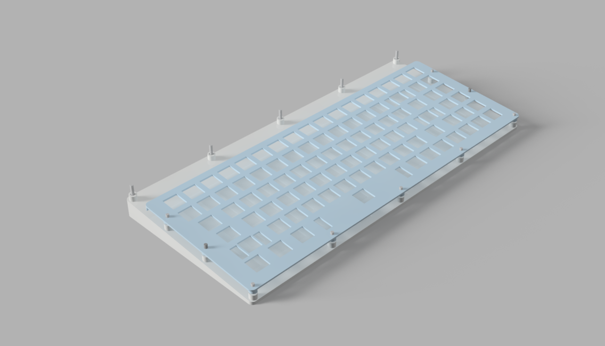
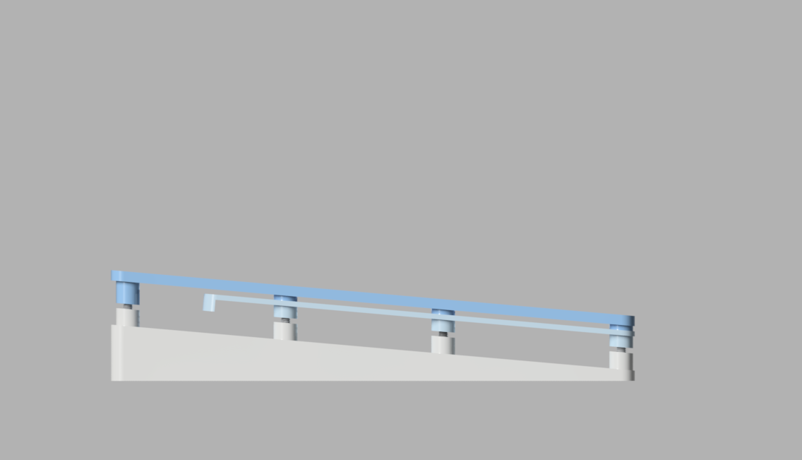

# K90R
A Custom 90 Keys Keyboard including Rotary Encoder Switch, OLED powered by Rasberry Pi Pico MCU and KMK Firmware.

## Features
- Per-Key RGB LED
- Hotswap Sockets
- OLED Display
- Rotary Encoder

## Bill of Materials

|Name                              |Quantity|Pack Of|Price (INR)|Cost (INR)|Cost (USD)  |Source                                                                                                                     |
|----------------------------------|--------|-------|-----------|----------|------------|---------------------------------------------------------------------------------------------------------------------------|
|Akko V3 Cream Black Pro Switch    |90      |45     |1199       |2398      |27.577      |[StacksKB](https://stackskb.com/store/akko-v3-cream-black-pro-switch-pack-of-45/)                                          |
|Veekos Gradient Keycaps           |1       |1      |1299       |1299      |14.9385     |[StacksKB](https://stackskb.com/store/veekos-gradient-keycaps-cherry-profile-135-keys/)                                    |
|Durock Smokey Screw-In Stabilizers|1       |1      |1595       |1595      |18.3425     |[StacksKB](https://stackskb.com/store/durock-smokey-screw-in-stabilizers-v2/)                                              |
|Gateron Hotswap Sockets           |90      |1      |10         |900       |10.35       |[StacksKB](https://stackskb.com/store/gateron-hotswap-sockets/)                                                            |
|1N4148 Diode                      |100     |100    |99         |99        |1.1385      |[Makerbazar](https://makerbazar.in/products/dip-rectifier-diode-through-hole?variant=46889718120688)                       |
|Raspberry Pi Pico                 |1       |1      |399        |399       |4.5885      |[Makerbazar](https://makerbazar.in/products/raspberry-pi-pico-development-boards?variant=47233117356272)                   |
|0.91 Inch OLED Display            |1       |1      |229        |229       |2.6335      |[Makerbazar](https://makerbazar.in/products/0-91-inch-i2c-iic-serial-4-pin-oled-display-module-blue?variant=45428382400752)|
|Rotary Encoder Module             |1       |1      |-          |-         |            |Self                                                                                                                       |
|SK6812MINI-E                      |90      |1      |6          |540       |6.21        |[LCSC](https://lcsc.com/product-detail/RGB-LEDs-Built-in-IC_OPSCO-Optoelectronics-SK6812MINI-E_C5149201.html)              |
|PCB (Option A)                    |1       |1      |5429       |5429      |62.4335     |[PCBPower](https://www.pcbpower.com/page/pcb-fabrication)                                                                  |
|PCB (Option B)                    |1       |1      |5325       |5325      |61.2375     |[JLCPCB](https://jlcpcb.com/)                                                                                              |
|PCB (Option C)                    |1       |1      |8245       |8245      |94.8175     |[LionCircuits](https://www.lioncircuits.com/)                                                                              |
|PCB (Option D)                    |1       |1      |5468       |5468      |62.882      |[Robu](https://robu.in/product/online-pcb-manufacturing-service)                                                           |
|4.7 k Resistor                    |2       |1      |-          |-         |            |Self                                                                                                                       |
|0.1 µF Capacitor                  |1       |1      |-          |-         |            |Self                                                                                                                       |
|Allen CSK M3 Screw 30mm           |5       |1      |11         |55        |0.6325      |[Novo3D](https://novo3d.in/allen-csk-screw/)                                                                               |
|Allen CSK M3 Screw 25mm           |2       |1      |9          |18        |0.207       |[Novo3D](https://novo3d.in/allen-bolt-cs/)                                                                                 |
|Allen Bolt M3 Screw 20mm          |2       |1      |7          |14        |0.161       |[Novo3D](https://novo3d.in/allen-csk-screw/)                                                                               |
|Allen CSK M3 Screw 16mm           |5       |1      |7          |35        |0.4025      |[Novo3D](https://novo3d.in/allen-csk-screw/)                                                                               |
|Brass Heat Set M3 6mm             |14      |1      |3          |42        |0.483       |[Novo3D](https://novo3d.in/brass-heat-set/)                                                                                |
|3D Printed Bottom                 |1       |1      |-          |-         |            |Printlegion                                                                                                                |
|3D Printed Top                    |1       |1      |-          |-         |            |Printlegion                                                                                                                |
|3D Printed Plate                  |1       |1      |-          |-         |            |Printlegion                                                                                                                |
|Shipping Charge Amazon            |1       |1      |100        |100       |1.15        |[Amazon](https://amzn.in/)                                                                                                 |
|Shipping + Handling LCSC          |1       |1      |590        |590       |6.785       |[LCSC](https://lcsc.com/)                                                                                                  |
|Misc.                             |1       |1      |200        |200       |2.3         |                                                                                                                           |
|**Total**                         |        |       |           |**13981** |**160.7815**|                                                                                                                           |

## Keyboard

## SideView

## Circuit

### Schematic

### PCB

### 3D 

## Additional Information

- **Firmware**: [KMK](https://github.com/KMKfw/kmk_firmware/)
- **Symbols and FootPrints**: [ScottoKicad](https://github.com/joe-scotto/scottokeebs/tree/main/Extras/ScottoKicad)
- **PCB Software**: [Kicad](https://www.kicad.org/)
- **3D Design Software**: [Autodesk Fusion 360](https://www.autodesk.com/in/products/fusion-360/overview)
